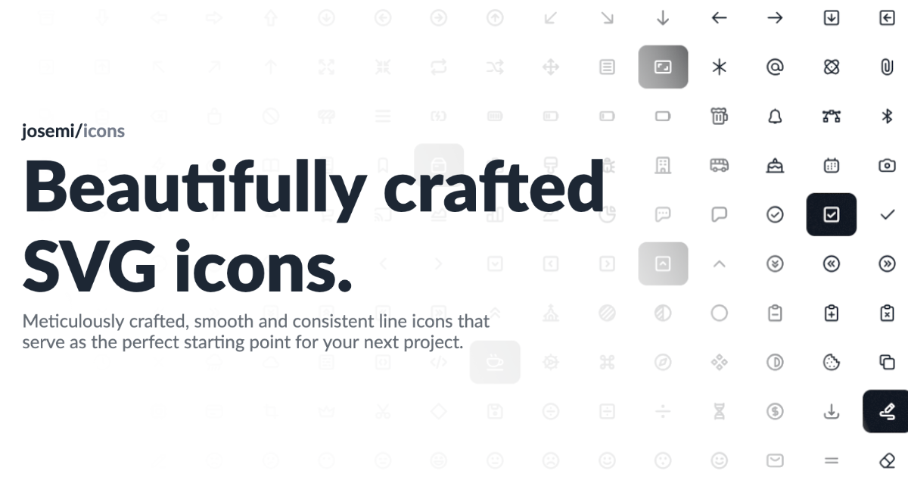

A collection of hand-made and open source SVG icons that you can use in your web projects. Each icon has been designed in a 24x24 grid with a stroke width of 2px and a minimum padding of 2px.

Our icons can be easily integrated in your project just copying the SVG code or using one of our packages.

## Usage

The easiest way is downloading or copying the icons from https://icons.josemi.xyz. Each icon consists in a `<svg>` tag and a single `<path>`.

```html
<svg xmlns="http://www.w3.org/2000/svg" viewBox="0 0 24 24" width="24" height="24">
    <path
        fill="none"
        stroke="currentColor"
        stroke-linecap="round"
        stroke-linejoin="round"
        stroke-width="2"
        d="M...."
    />
</svg>
```

You can also include the icons as images in a `` element using a public CDN:

```html

```

Read more about how to use icons in the [Usage section](https://icons.josemi.xyz/usage.html) of our website.

## Packages

The following NPM packages are managed on this repository:

| Package | Description | Version |
| ------- | ----------- | ------- |
| **[@josemi-icons/svg](./packages/svg)** | A single package including all icons in SVG. |  |
| **[@josemi-icons/react](./packages/react)** | Use icons as React components. |  |
| **[@josemi-icons/css](./packages/css)** | Use icons with CSS. |  |

## License

Code is licensed under the [MIT LICENSE](./LICENSE).

Icons in this repository are [Public Domain](https://creativecommons.org/publicdomain/zero/1.0/). You can use, copy, modify, distribute, or display the icons without any restrictions or attribution requirements. They are offered on an "as-is" basis, without warranties or conditions of any kind.

By using the icons in this repository, you agree that they are provided without any warranty, and the author(s) shall not be liable for any claim, damages, or other liability arising from the use of the icons.
