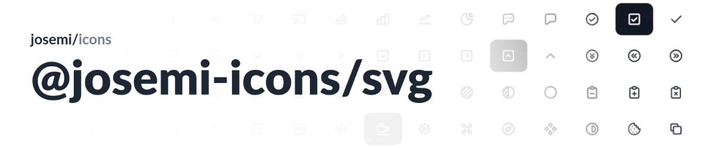

## Installation

To use our icons in your projects, you can install the package via **Yarn** or **NPM**:

```shell
# Install using Yarn
$ yarn add @josemi-icons/svg

# OR install using NPM
$ npm install @josemi-icons/svg
```

## Usage

### As HTML Images

You can include the icons in your HTML files as standard images using the ``` element. To do this, first, copy the desired icon from the package and then reference it in your HTML.

```html

```

### Inline HTML

For more control and customization, you can copy the SVG code of the icon directly into your HTML files. This allows you to easily adjust the icon's size, color, and other properties.

Example:

```html
<style>
    .icon {
        fill: #ff0000; /* Customize the color */
        width: 24px;   /* Customize the size */
        height: 24px;
    }
</style>

<svg xmlns="http://www.w3.org/2000/svg" class="icon" viewBox="0 0 24 24">
    <!-- Paste the SVG code of the icon here -->
</svg>
```

## License

Under the [MIT LICENSE](https://github.com/jmjuanes/icons/blob/main/LICENSE).
